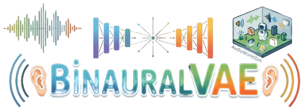
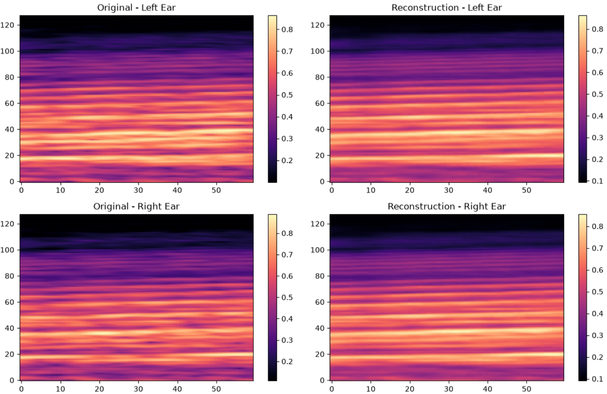
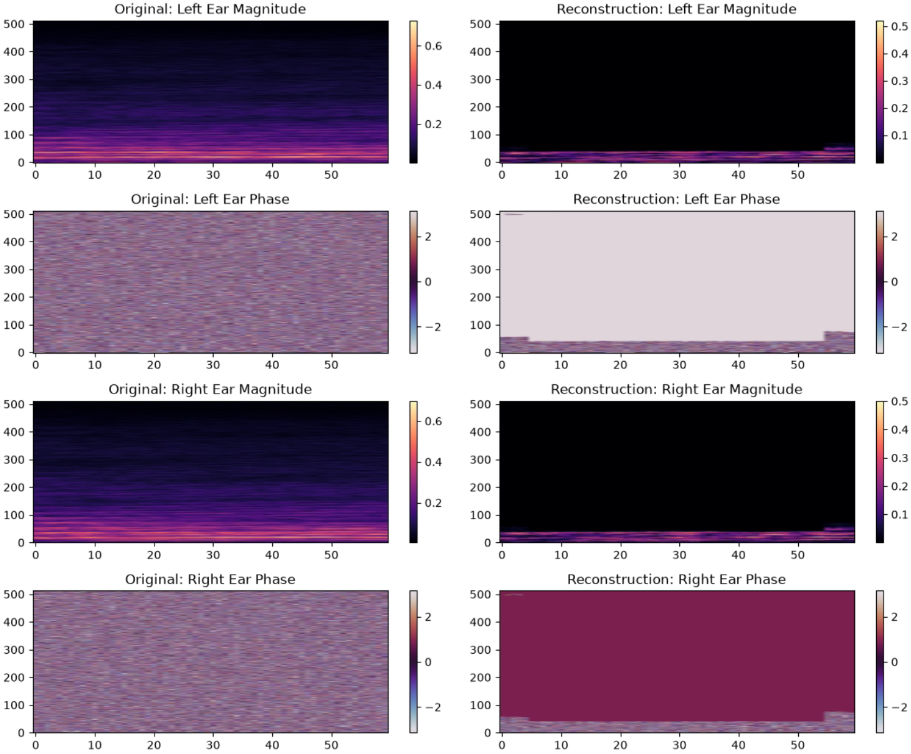

<p align="center">
  
</p>

# BinauralVAE: Spatial Audio Reconstruction

Welcome to **BinauralVAE**. This project explores several Variational Autoencoder (VAE) approaches - including complex-valued variants - to reconstruct spatialized audio. 

Developed alongside [AudioWorldSim](https://github.com/Luizerko/AudioWorldSim), this project serves as a foundation for generating latent state representations for a binaural, audio-based world model. We highly recommend checking out AudioWorldSim for a better understanding of the acoustic data used here. The core objective is to reconstruct binaural audio data corresponding to every action a robot takes in a simulation, effectively translating acoustic information into navigational states.

This project was developed by [Luis Zerkowski](https://luizerko.github.io/) under the supervision of [Luiz Velho](https://lvelho.impa.br/) at [VISGRAF](https://www.visgraf.impa.br/home/index.php), the Vision and Graphics Laboratory at [IMPA](https://impa.br/?lang=en).

<p align="center">
  <br>
  
  <br>
</p>

<div align="center">
  <table width="800" height="320">
    <tr>
      <td align="center" width="375" height="10">
        <video src="https://github.com/user-attachments/assets/e8e4080e-d7e8-43e9-8f8b-8e04789bf00b" controls></video>
        <b>Original Mel Spectrogram Audio Reconstuction</b>
      </td>
      <td align="center" width="375" height="10">
        <video src="https://github.com/user-attachments/assets/44de2358-ae64-4c5a-978a-13f41b4a61e2" controls></video>
        <b>Reconstructed Mel Spectrogram Audio Reconstuction</b>
      </td>
    </tr>
  </table>
  <i>Figure 1 + Audio 1: Illustrative examples of one of the pipelines. Comparison of the original Mel spectrogram example (left) versus the reconstructed output (right). Listen to what they sound via Griffin-Lim reconstruction of each version below the images.</i>
</div>

<br>
<br>

<p align="center">
  <br>
  
  <br>
</p>

<div align="center">
  <table width="800" height="320">
    <tr>
      <td align="center" width="375" height="10">
        <video src="https://github.com/user-attachments/assets/41c85043-3c4f-46fc-b1fe-f1ab8901e648" controls></video>
        <b>Original Complex STFT Spectrogram Audio Reconstuction</b>
      </td>
      <td align="center" width="375" height="10">
        <video src="https://github.com/user-attachments/assets/988f80d6-9ac2-4359-aa39-589270df25ff" controls></video>
        <b>Reconstructed Complex STFT Spectrogram Audio Reconstuction</b>
      </td>
    </tr>
  </table>
  <i>Figure 2 + Audio 2: Comparison of the original magnitude and phase example (left) versus the reconstructed output (right). Listen to the direct inverse STFT playback of each version below the images.</i>
</div>

---

## Introduction

The primary goal of this repository is to develop a pipeline for binaural audio reconstruction using Variational Autoencoders (including complex-valued variants). This is the first step toward an **audio-based world model**, allowing us to encode binaural audio captured during robotic navigation.

Using [AudioWorldSim](https://github.com/Luizerko/AudioWorldSim), a simulated robot navigates a room equipped with a binaural sensor that captures realistic audio data based on room acoustics and a Head-Related Transfer Function (HRTF). Because the robot captures audio with every action, we can map the direct connection between actions and resulting left/right ear audio. This forms the perfect basis for an audio-based world model that connects states, actions, and the acoustic consequences of those actions.

While visual world models are prevalent, research into realistic spatial audio reconstruction and audio-only world models remains sparse, and open-source implementations are even rarer. This project bridges that gap. We provide highly flexible, mathematically grounded architectures to explore multiple VAE options for spatial audio reconstruction. 

Unlike images, sound does not suffer from visual occlusion. It offers a complementary, albeit different, sense of perception. Imagine navigating an indoor blackout using only the sound of an emergency siren, or rescuers locating someone in a pitch-black cave by following their voice. We are naturally not advocating against multimodality. Rather, we emphasize that sound alone holds essential information for understanding the world and the consequences of actions, an area often overshadowed by vision-first approaches.

We have compiled a comprehensive list of [References](https://github.com/Luizerko/audio-nav/blob/main/REFERENCES.md) covering the literature that guided this project. We highly recommend exploring these works.

---

## Installation Guide

The following steps describe the setup for our tested environment. While you don't necessarily need the exact same package versions or `CUDA` builds, please be aware that version mismatches may cause compatibility issues.

```bash
# Create and activate the environment
conda create -n ar python=3.13
conda activate ar

# Install PyTorch (GPU support is crucial)
pip install torch==2.11.0+cu128 -f https://download.pytorch.org/whl/torch/
pip install torchvision==0.26.0+cu128 -f https://download.pytorch.org/whl/torchvision/
pip install torchaudio==2.11.0+cu128 -f https://download.pytorch.org/whl/torchaudio/

# Install remaining dependencies
pip install -r requirements.txt
```

**Optional:** If you intend to use neural audio reconstruction for Mel spectrograms via [BigVGAN-v2](https://github.com/NVIDIA/BigVGAN), run the following as well:

```bash
git clone https://github.com/NVIDIA/BigVGAN bigvgan
pip install -r requirements_bvg.txt
```

---

## Pipeline Usage

This repository offers a highly flexible pipeline: you can train a model from scratch, run a grid search for hyperparameter tuning, perform inference, or "dream" to explore your model's latent space capabilities. Because of the architectural flexibility, our scripts accept numerous parameters. They are documented below. For deeper insights into the specific models provided and more pipeline outputs, please read our [Models Documentation](https://github.com/Luizerko/audio-nav/blob/main/MODELS.md).

### Set Up

If you generated your data using [AudioWorldSim](https://github.com/Luizerko/AudioWorldSim), simply navigate to the data directory and run the processing script:

```bash
cd data
python data_processing.py
```

This transforms and normalizes the data for all three available modalities. If you are using custom data, check the normalization methods inside `data_processing.py` to replicate the process. Your repository structure should look like this:

```plaintext
data/
 ├── mel_stats.pt            # Min-max normalization values for Mel spectrograms
 ├── stft_stats.pt           # Min-max normalization and 0.3 power-law values for STFT 4-Channel stacked spectrograms
 ├── complex_stats.pt        # 0.3 power-law and max normalization values for raw STFT complex outputs
 ├── dataset/
 │   ├── seed_1/
 │   │   ├── mel/
 │   │   │   ├── binaural_image_1.pt
 │   │   │   └── ...         # Additional binaural images
 │   │   ├── stft_4ch/
 │   │   └── stft_complex/
 │   ├── mel_ref_power.pt    # Mel reference power per seed for proper audio mapping
 │   └── ...                 # Additional seeds
 └── data_processing.py
train.py
grid_search.py
inference.py
dream.py
```

Our "binaural images" are actually small spectrograms representing 0.2 seconds of audio (the exact duration of one simulation action). More specifically:

- **Audio Specs:** 44.1kHz sample rate, hop length of 147.

- **Mel STFT:** 2048 samples, 128 Mel bands. Shape: [2, 128, 60] (Index 0 = Left ear, Index 1 = Right ear).

- **4-Channel STFT:** 1024 samples. Shape: [4, 513, 60] (0 = Left magnitude, 1 = Left phase, 2 = Right magnitude, 3 = Right phase).

- **Complex STFT:** 1024 samples. Shape: [2, 513, 60] (0 = Left complex STFT, 1 = Right complex STFT).

### Training

You have two options: train a single model or run a parallel grid search. To train a single model, run:

```bash
python train.py [ARGS]
```

- ``--dataset_dir``: Path to the processed ``.pt`` dataset directory.

- ``--dataset_method``: Audio processing method (mel, stft_4ch, stft_complex). Matches AudioWorldSim output.

- ``--save_dir``: Directory to save model weights (default: ``models/checkpoints/``).

- ``--log_dir``: Directory for Tensorboard logs (default: ``runs/``).

- ``--run_name``: Run name for Tensorboard visualization.

- ``--train_size``: Train/validation split ratio (default: 0.9). Note: For benchmarking`with a test set, split entire seeds beforehand rather than individual audio frames.

- ``--epochs``: Number of training epochs (default: 100).

- ``--batch_size``: Batch size (default: 256).

- ``--learning_rate``: Adam optimizer learning rate (default: 1e-3).

- ``--weight_decay``: Weight decay for optimizer (default: 1e-5).

- ``--warmup_epochs``: Number of epochs for optimizer to warmup. Only ever used for stabilizing training for CVAE (default: 1).

- ``--patience_tol``: Tolerance value for early stopping (default: 0.02).

- ``--beta_max``: Maximum beta weight for KL Divergence loss (default: 0.8).

- ``--beta_cycles``: Number of cycles the beta weight goes through. We found that a linear increasing start followed by cyclic up/down movement usually yields the best KL-divergence vs. reconstruction loss balance, avoiding latent space collapse and still allowing for decreasing reconstruction loss.

- ``--w_init``: Weight initialization method (he, xavier, torch_default).

- ``--latent_dim_pow``: Size of the latent space in powers of 2 (e.g., 5 = 32 dimensions).

- ``--n_filters``: Number of convolution/deconvolution layers (the architecture is always symmetric in terms of convolution/deconvolution layers).

- ``--kernel_v`` / ``--kernel_h``: Vertical / horizontal kernel sizes.

- ``--stride_v`` / ``--stride_h``: Vertical / horizontal strides.

- ``--pad``: Amount of padding.

- ``--num_workers``: Number of CPU workers for DataLoader (default: 24).

For the grid search, edit ``param_grid_<dataset_method>`` dictionary inside ``grid_search.py`` to set your hyperparameter ranges, then run:

```bash
python grid_search.py --num_trains <int>
```

``--num_trains``: How many parallel training sessions to run. Be mindful of your GPU memmory and CPU cores to avoid bottlenecking the GPU parallel processing and ``num_workers``. (Note: CVAE requires specific tuning found in ``CVAE.py`` and is excluded from the grid search by default).

### Inference

To test your trained model on a real navigation seed and reconstruct the spatialized audio, run:

```bash
python inference.py [ARGS]
```

- ``--checkpoint_path``: Path to the saved model ``.pt`` file.

- ``--output_file``: Name of the generated output audio file.

- ``--seed_idx``: Index of the seed to reconstruct (required).

- ``--rec_method``: Reconstruction method for Mel spectrograms (``gl`` for Griffin-Lim or ``bvg`` for BigVGAN-v2).

- ``--n_samples``: STFT processing samples (Mel=2048, STFT=1024).

- ``--mel_bands``: Amount of Mel bands used (default: 128).

- ``--hop_len``: Mel/STFT time resolution (default: 147).

- ``--sample_rate``: Original audio sample rate (default: 44100).

### Dream

Navigate and explore the generative capabilities of your trained latent space by interpolating between latent points:

```bash
python dream.py --reference_seed <seed_idx> [ARGS]
```

- ``--reference_seed``: A real dataset seed index used purely to extract input shape dimensions and Mel reference power (required).

- ``--num_steps``: Total number of interpolated frames to generate (default: 32).

- ``--num_keyframes``: Number of random latent points to interpolate between (must be ≥ 2).

## Attributions

If you found this work helpful, please cite our technical report:

```plaintext
[ArXiv link coming soon :)]
```

Please also ensure you cite the core works that made this pipeline possible:

- [AudioWorldSim](https://github.com/Luizerko/AudioWorldSim), the binaural realistic acoustic datasets.

- [World Models](https://arxiv.org/abs/1803.10122) and this [implementation](https://github.com/BrunooCS/World-Model-2018/).

- [Complex-Valued Variational Autoencoder](https://www.isca-archive.org/interspeech_2020/nakashika20_interspeech.pdf), this [implementation](https://github.com/MateoCamara/complex-vae/), and [complexPyTorch](https://github.com/wavefrontshaping/complexPyTorch/).

- [Griffin-Lim Algorithm](http://hil.t.u-tokyo.ac.jp/~kameoka/SAP/papers/Griffin1984__Signal_Estimation_from_Modified_Short-Time_Fourier_Transform.pdf).

- [BigVGAN-v2](https://github.com/NVIDIA/BigVGAN).
